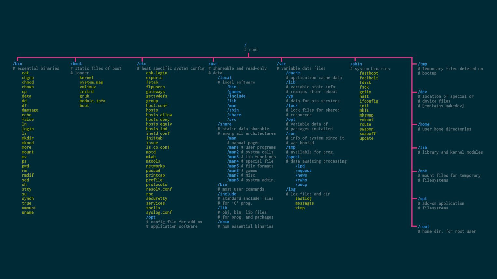
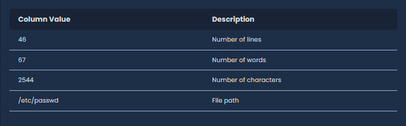

# Introduction to Cybersecurity

Training Summary
This training is designed for individuals who are new to cybersecurity or want to strengthen their foundational knowledge. The course begins with the basic principles of information security, covering the importance of information security, the types of data that need protection, and the fundamental pillars of information security. Subsequently, the course provides insights into hackers and types of hackers, detailing the role of ethical hackers and their contributions to the cybersecurity ecosystem.

The training also explores the sub-fields of cybersecurity and the different career paths within these fields, helping participants discover areas of specialization based on their interests. The course delves into specific topics such as penetration testing and its various types, providing fundamental knowledge about networks, ports, and their importance from a security perspective. This section aims to equip participants with a basic understanding of identifying security vulnerabilities and how these vulnerabilities can be exploited.

## Information Security

Information security involves protecting information from unauthorized use, disclosure, destruction, alteration, damage, or preventing unauthorized access to it.

### Principles of Information Security: The CIA Triad

__Confidentiality__: Ensures that information is accessible only to authorized individuals and prevents others from viewing it.

__Integrity__: Means that information remains accurate and unchanged, preventing it from being accidentally or intentionally altered.

__Availability__: Ensures that information is easily accessible to authorized users when needed.

---


---

Information security encompasses the protection of both physical documents and electronic data. This includes a wide range of measures, from encryption techniques to access control systems and antivirus software.

Today, especially with the widespread use of the internet, information security is of vital importance for both individuals and organizations.

### Hacker
The concept of "hack" is a versatile term used in various fields and can carry different meanings depending on the context. Generally, it can be described as using or modifying a system in unintended ways.

A hacker is a skilled computer expert with in-depth technical knowledge of computer systems and networks, capable of utilizing this knowledge for various purposes.

Hackers are often curious, problem-solving individuals who think creatively and have a keen interest in technology.

### Types of Hackers

Hackers are categorized into three types based on their approaches and behaviors.

**Black Hat**: Black hat hackers are malicious hackers who harm systems, steal information, and gain unauthorized access to systems.

**White hat** hackers work to enhance system security. They collaborate with companies to identify security vulnerabilities and help them fix these issues.

**Gray Hat**: Gray hat hackers know the techniques and methods used by malicious hackers and recognize the tools and software used during hacker activities. They are computer experts who sometimes may violate the law but generally operate within legal bounds and uphold ethical standards.

### Ethical Hacker

Ethical hackers fall under the category of white hat hackers.

The role of ethical hackers is to test and strengthen the security of computer systems, networks, and data. In addition to having deep technical knowledge, being an ethical hacker requires strong ethical values and a sense of responsibility. Ethical hackers typically enhance their skills through specialized training and certifications.

Ethical hackers perform penetration tests to identify potential security vulnerabilities, conduct vulnerability analysis, and perform risk assessments. Their goal is to uncover weaknesses that attackers could exploit and make recommendations to fix them.

In the cybersecurity world, the role of ethical hackers is becoming increasingly important. As technology becomes more integrated into our lives, the demand for these experts in ensuring the security of the digital world also increases.

> Question
>Q: What is the sum of the squares of the numbers from 1 to 100?
>A: 338350
>Explanation: The first method that might come to mind to solve this problem is to take the squares of each number from 1 to 100 and sum them up one by one. However, using the formula n * (n + 1) * (2 * n + 1) / 6 allows for a much faster solution, stepping outside the usual approach—what we can call a mathematical hack.


---

## Sub-Fields of Cybersecurity

Cybersecurity is a concept that represents our security in the digital world. To ensure our security in the digital realm, cybersecurity encompasses many critical sub-fields. Each area is a specialized domain and a crucial part of protecting our systems.

Let's take a closer look at the important sub-fields of cybersecurity.

### Application Security

Application security focuses on ensuring the security of applications from the development stage onward. This area includes identifying and fixing software bugs and other security vulnerabilities. Security tests and secure coding standards are important components of this field.

### Web Application Security

Web application security focuses on detecting, preventing, and mitigating threats to web-based applications. In this field, vulnerabilities such as SQL Injection, XSS, CSRF, and IDOR are among the most common. Web application security is essential for protecting user data, maintaining application performance, and preserving the reputation of enterprises.

Regular penetration tests (pentests) are conducted to identify and address security vulnerabilities in web applications.

### Network Security

Network security involves protecting network resources to prevent, detect, and respond to malicious threats and attacks. Technologies such as firewalls, intrusion detection systems (IDS), intrusion prevention systems (IPS), and virtual private networks (VPN) are used in this field.

### Reverse Engineering

Reverse engineering involves analyzing software, devices, or systems to understand how they work, both statically and dynamically. This field can be used to find security vulnerabilities, analyze malware, and bypass licensing or other protection mechanisms.

### Cloud Security

Cloud security ensures the protection of data, applications, and infrastructure in cloud computing services. This includes identity and access management (IAM), data encryption, firewalls, and other cloud-based security protocols. Cloud security ensures that data is stored, processed, and transmitted securely in the cloud.

### Mobile Application Security

Mobile application security encompasses security measures specific to mobile devices and applications. This includes protection against malware, preventing data leaks, and implementing end-to-end encryption techniques.

### IoT Security

IoT (Internet of Things) security involves ensuring the security of smart devices, sensors, and other IoT devices. This area covers device security, data protection, and network security. IoT security is critically important for protecting the expanding IoT ecosystem from threats.

### Digital Forensics

Digital forensics includes technical and legal procedures for investigating and analyzing cybercrimes. This field focuses on practices such as data recovery, electronic evidence collection, and investigating cybercrimes. Digital forensics plays a vital role in criminal investigations and legal processes.

### Threat Intelligence

Threat intelligence involves gathering and analyzing information about cyber threats. This information is used to prevent, detect, and respond to threats. Threat intelligence provides security teams with the ability to anticipate attacks and take proactive measures.

## Career
As cyber attacks and threats increase every day, interest and employment in the field of cybersecurity continue to grow. Companies invest in this field to protect their reliability and reputation, while countries also invest similarly to prepare for potential cyber warfare.

The increase in investments in cybersecurity drives both technological innovation and the expansion of job opportunities in the sector.

Below, you can see graphs showing employment numbers and workforce gaps in the cybersecurity sector.

--- 


---

As seen in the above graphs, although there is an increasing employment rate in recent years, the workforce gap also grows each year.

Various positions in cybersecurity include developing defense and attack strategies, hardening systems to enhance security, or performing penetration tests to improve the security of institutions.

### Career Journey
Anyone considering a career in cybersecurity will encounter many challenges and opportunities on this journey. The key to success in this process is undoubtedly regular and focused discipline.

Since cybersecurity requires deep technical knowledge, you may occasionally feel inadequate. However, aside from these challenges, the sector offers high financial rewards and flexible working conditions, such as remote work, making it an attractive field.

It is important to network and meet experienced professionals in this field to advance. Connecting with these individuals through online forums, professional networks like LinkedIn, Discord channels, or cybersecurity conferences and workshops can provide significant benefits in terms of knowledge exchange.

As you expand your network and enhance your technical skills, don't forget to develop your social skills, which are often overlooked but crucial for cybersecurity professionals. Communication skills, responsibility, team collaboration, and problem-solving abilities are among the essential social characteristics needed for success in this field.

As someone starting or considering starting a career in cybersecurity, you should ask yourself the following questions:

- How strong is my interest in technology and innovation?
- How open am I to learning new information?
- Do I trust myself in solving problems I encounter?
- Am I a team player?
- How do I react under stress, and how can I manage it?
- Am I ready to work long hours if needed to complete projects on time?
Cybersecurity is a constantly evolving field that presents new challenges. Therefore, you must be prepared for the challenges you will encounter and continually learn and adapt to succeed in your cybersecurity career.

> Teams
Cybersecurity is a field with many sub-disciplines. The teams listed below help organizations counter cyber threats and ensure the organization's security. Although each team has different roles and responsibilities, they all serve a common goal: strengthening the organization's cybersecurity posture.

**Red Team**

The Red Team is a group that acts from the attacker's perspective to test an organization's cybersecurity. Their aim is to discover potential vulnerabilities and security gaps, exploit these weaknesses, and realistically test the organization's cyber defense capabilities. Red Team operations include various methods such as attack scenarios, penetration tests, and social engineering tactics. Their work helps understand how well the organization's defenses are prepared for real-world threats.

**Blue Team**

The Blue Team is responsible for strengthening and maintaining the organization's cybersecurity defenses. This team defends the organization against the Red Team's attack attempts, continuously monitors and improves security measures to prevent and detect security breaches. The Blue Team's duties include monitoring and managing firewalls, intrusion detection systems, and other security solutions, incident response, implementing security policies, and providing security awareness training to employees.

**Purple Team**

The Purple Team aims to maximize the organization's cybersecurity capabilities by combining the efforts of the Red and Blue teams. Serving as a bridge between the Red and Blue teams, the Purple Team allows both sides to learn from each other and develop their skills. They guide the Blue Team on how to address vulnerabilities discovered by the Red Team and provide feedback to enhance the effectiveness of defense strategies.

**Bug Bounty**
Bug Bounty is a defense strategy for companies and a revenue source for cybersecurity researchers that has gained significant popularity in recent years. In bug bounty programs, cybersecurity researchers who discover security vulnerabilities within the specified scope and report these vulnerabilities are rewarded with money. Through these programs, organizations become more resilient to cyber attacks while cybersecurity researchers can earn income.

## Penetration Testing (Pentest)

Penetration testing is the process of identifying potential security vulnerabilities in an organization's software, systems, and IT infrastructure by simulating real-world cyber attacks. These tests help organizations strengthen their defenses, identify critical vulnerabilities ahead of time, and minimize the impact of a potential security breach.

Penetration tests are conducted within the framework of a contract signed between the organization requesting the test and the organization performing the test. This contract ensures that the test activities are conducted legally and defines the scope of the test. Only the components specified in the contract may be tested, ensuring that the process adheres to both legal and ethical standards.

Professionals involved in penetration testing are usually referred to as "pentesters," "penetration testers," or "cybersecurity experts." These professionals conduct tests within the scope of their given authority using an ethical hacker approach and report the security vulnerabilities they identify.

### Types of Penetration Testing
Penetration tests can be classified into three main categories based on the level of information provided: White Box, Grey Box, and Black Box.

_**White Box**_

The team conducting the test is given comprehensive information and authority about the system. This approach allows for an in-depth analysis and testing of the system.

_**Grey Box**_

The team performing the test is provided with partial information and authority about the system. This creates a more realistic test scenario and demonstrates how pentesters can progress with partial information.

_**Black Box**_

The test team conducts the test without any prior knowledge about the system. This offers the most realistic scenario from the perspective of an actual attacker.

_**Penetration Testing Methodologies**_
Penetration testing methodologies are standardized approaches used to systematically identify and assess security vulnerabilities. These methodologies enhance both the effectiveness and efficiency of penetration tests.

_**OWASP**_

The Open Web Application Security Project (OWASP) is a global initiative focused on improving the security of web applications. The OWASP penetration testing methodology provides a framework for identifying, assessing, and mitigating security vulnerabilities in web applications and services. This methodology guides both developers and security experts in ensuring application security.

_**OSSTMM**_

The Open Source Security Testing Methodology Manual (OSSTMM) provides a methodology for information security testing and can be applied to a wide range of areas such as network security, application testing, and physical security audits. OSSTMM offers a detailed methodology that ensures security tests are conducted transparently, objectively, and repeatably. It also provides guidance for measuring security performance and continuously improving the security posture.

_**NIST**_

The National Institute of Standards and Technology (NIST) penetration testing methodology provides standards and best practices, particularly for government agencies and large-scale organizations. NIST's cybersecurity methodology encompasses risk management, the assessment of security vulnerabilities, and post-breach incident management processes. This methodology helps organizations conduct comprehensive security assessments and meet compliance requirements.

## Basic Information

#### Port
Ports are virtual or physical connection points used for data transfer between computers.

#### Physical Ports

Physical ports are hardware-based connection points found on computers. Examples include USB, Ethernet, HDMI, and DisplayPort, which are used to connect various devices to the computer and facilitate data transfer.

#### Virtual Ports

Virtual ports are numbered between 0 and 65535 and are used for communication over a network. Each port number is associated with specific services or protocols, and all data transfer over the internet occurs through these virtual ports.

For example, when visiting websites, we connect to port 80 or 443 on the server hosting the website.

Commonly used services and protocols operate on specific ports. Below is a table of some frequently used ports and services:

--- 


---

### Vulnerability
A vulnerability refers to security weaknesses in computer systems. These weaknesses can be exploited by attackers to gain unauthorized access, steal data, or use the system for malicious purposes.

**OWASP TOP 10**: A list ranking the most critical security vulnerabilities in web applications.

**CVE (Common Vulnerabilities and Exposures)**: A public directory that identifies known security vulnerabilities and exposures.

**CVSS (Common Vulnerability Scoring System)**: A scoring system used to measure the severity of security vulnerabilities.

### Exploit
An exploit is the code or technique that enables the malicious use of a vulnerability. This allows attackers to gain unauthorized access or control over systems.

**PoC (Proof of Concept)**: Demo content demonstrating the exploitability of a vulnerability.

**_Zero Day_**: Security vulnerabilities that are not yet patched and are generally unknown to the public.

### Shell
A shell is a computer program that provides users with an interface to use the services of an operating system.

Gaining a shell on a system allows an attacker to execute commands on the target system through an interface.

**Bind Shell**: A type of shell where the attacker opens a port on the target machine and connects to it to execute commands.

**Reverse Shell**: A type of shell where the target machine connects back to the attacker's machine, allowing the execution of commands.

**Web Shell**: A type of shell that includes a malicious script running on a web server, giving the attacker remote command execution capabilities.

### IP (Internet Protocol) Address
An IP address is a unique number that identifies devices on the internet and facilitates communication between them.

**IPv4**: Uses a 32-bit addressing system and provides approximately 4.3 billion unique addresses.

**IPv6**: Developed due to the insufficient addressing capacity of IPv4, it uses a 128-bit addressing system.


--- 

# Linux Fundamentals

This training provides a comprehensive introduction for participants who are new to the Linux operating system or wish to improve their basic skills. The course begins by explaining what Linux is, how it came about, and why it is so popular worldwide. It then introduces various Linux distributions and explains how each one can cater to different needs. Participants will learn the basics of the Linux shell and become familiar with the fundamental principles of interacting via the command line. Essential topics such as navigating between directories, managing files and folders are covered in detail, allowing users to move comfortably within the Linux environment and perform necessary tasks.

The training provides an in-depth look at methods for finding files and folders, text editing tools, filters, and more. Advanced topics such as package management, user and group management, and file and folder permissions are also covered, showcasing some of Linux's powerful features and how to manage them effectively within the system. By learning process management—controlling applications running on the system—and network management—configuring network settings on Linux—participants will gain the skills to use their Linux systems more efficiently.

Linux Architecture
The Linux operating system is composed of several layers that manage the computer's resources and facilitate user interaction:

---


---


**Hardware Layer**: This is the physical foundation of the system, composed of the computer's processor (CPU), memory (RAM), storage (hard disks), and peripherals such as keyboards, mice, and printers.

**Kernel Layer**: The kernel is the heart of Linux and is vital to the operating system. It acts as an intermediary between software and hardware. The kernel manages tasks such as memory allocation, process scheduling (deciding when and what tasks the CPU should execute), and handling input/output requests from software. This layer ensures that different programs and users running on the system do not interfere with each other and have the necessary resources to operate.

**Shell Layer**: The shell is the user interface for accessing the services of the kernel. It is commonly a command-line interface (CLI) where users type commands, but graphical shells also exist. The shell allows users to interact with the kernel to run programs, manage files, and request other services by typing commands or using a graphical interface.

**System Utility Layer**: This layer contains various tools and applications necessary for performing tasks on the computer. System utilities can range from file management tools to software installers, network configuration tools, and more. They serve as a bridge between the user's commands (entered in the shell or through a graphical interface) and the kernel's handling of those commands.

>In summary, Linux architecture organizes the interaction between the computer's hardware and user activities from physical components to software applications through a well-defined management and control layer.


### Linux Distributions
Linux is not a single operating system but a family of open-source operating systems built around the Linux kernel. These variants are known as "distributions" or "distros." Each distribution offers a different flavor of Linux tailored for various types of users, devices, and purposes. This section explores the concept of Linux distributions, their importance, and examples of popular distros.

What are Linux Distributions?
A Linux distribution is a complete operating system built around the Linux kernel. It includes the kernel, a wide array of software applications, libraries, and optionally a graphical user interface (GUI). Distros are developed by various organizations, communities, and even individuals, focusing on different needs such as usability, stability, security, or customization.

Why Are There Different Distributions?
The diversity of Linux distributions stems from the philosophy of freedom and flexibility. Different users have different needs, ranging from personal computers to servers, from beginners to experts, and from lightweight systems for older hardware to feature-rich environments for modern machines. Distributions meet these varied requirements by offering specialized software packages, user interfaces, and management tools.

Core Components of a Distribution
While each distribution offers unique features and software, they all share several core components:

**Linux Kernel**: The heart of the operating system, managing hardware resources.
**System Libraries**: Essential for running applications, providing standard ways to interact with the kernel.
**Software Applications**: Ranging from system utilities to end-user applications.
**Package Manager**: A tool for installing, updating, and managing software applications and components.
**Bootloader**: Software that manages the boot process of the computer after power is turned on.
**Graphical User Interface (GUI)**: Optional, but most distros offer a GUI for ease of use, such as GNOME, KDE, or XFCE.
#### Popular Linux Distributions


_**Ubuntu**_

Target Audience: Beginner and regular desktop users.
Features: User-friendly, strong focus on ease of installation and usability. Extensive documentation and community support.
Use Cases: Desktops, servers, and cloud environments.

_**Fedora**_

Target Audience: Developers and system administrators.
Features: Cutting-edge technology, close alignment with the Linux community, strong emphasis on free software.
Use Cases: Development, servers, and workstations.

_**CentOS**_

Target Audience: Servers and enterprise users.
Features: Stability and long-term support, binary compatibility with RHEL (Red Hat Enterprise Linux).
Use Cases: Servers, enterprise environments.

_**Debian**_

Target Audience: Advanced users and environments focusing on stability.
Features: Large package repository, strict free software guidelines, stability.
Use Cases: Servers, desktops, embedded systems.

_**Arch Linux**_

Target Audience: Experienced users and enthusiasts.
Features: Rolling release model, user-centric approach focusing on customization and minimalism.
Use Cases: Desktops, development, personal servers.

_**Kali Linux**_


Target Audience: Security professionals and ethical hackers.
Features: Preloaded with a wide range of tools for penetration testing, security research, computer forensics, and reverse engineering.
Use Cases: Security research, penetration testing, and ethical hacking.

#### Choosing the Right Distribution
Choosing the right distribution depends on your specific needs, level of expertise, and preferences. Consider the following factors:

- Purpose: Desktop use, server, development, etc.
Ease of Use: Is it beginner-friendly or requires Linux expertise?
- Support and Community: Access to documentation, forums, and community support.
- Hardware Compatibility: Supports your hardware, especially for older or specialized equipment.
- Software Availability: Availability of the software packages you need.
In conclusion, Linux distributions offer a wide range of choices for users of all levels and purposes. By understanding the unique features and target audiences of each distro, you can select the one that best meets your needs.

Linux operating systems offer various shells, each with unique features and command syntax:

**BASH (Bourne Again SHell)**: The most widely used Linux shell, serving as the default shell on Linux and macOS. BASH is known for its comprehensive scripting capabilities and extensive support.

**CSH (C Shell)**: The syntax and usage of C Shell are similar to the C programming language, making it appealing for users familiar with C.

**KSH (Korn Shell)**: The Korn Shell, which forms the basis for the POSIX Shell standard features, combines elements from BASH and CSH, offering powerful scripting abilities and command-line editing features.

**ZSH (Z Shell)**: ZSH incorporates features from BASH, KSH, and TCSH, offering robust auto-completion functions, customizable prompts, and numerous plugins and themes through frameworks like Oh My Zsh.

**Fish (Friendly Interactive SHell)**: Known for its user-friendly interface, Fish provides features like syntax highlighting, auto-suggestions, and tab completions without requiring additional configuration.

While all these shells perform the basic task of command interpretation, they vary in the specific commands they support, built-in functionalities, and scripting capabilities, allowing users to choose the shell that best fits their preferences and needs.

### What is a Terminal?
The terminal application serves as a gateway for users to interact with the shell, providing a text-based interface where commands can be entered and their outputs viewed. It is a critical tool for executing commands directly and is also used to run larger scripts designed to automate and perform repetitive and complex tasks.

To open the terminal, you can usually find it by typing 'terminal' into the search box in the graphical interface and launching it by double-clicking the result.


## Linux File System Structure

The Linux file system is hierarchically organized, starting with the root directory /. Understanding this structure is key to effectively navigating in Linux.

---



---

### File and Directory Operations
In Linux's powerful command-line interface, there are numerous commands to work with files and directories. In this section, you will learn how to create, copy, move, delete, and search for files and directories. Additionally, we will look at some basic commands used to change file and directory permissions.

#### Creating Files and Directories

In Linux, the touch command is used to create files. This command can also be used to update the access and modification times of existing files, but if the file specified does not exist, it will create a new empty file.

`user@hackerbox:~$ touch readme.txt`

The command above creates an empty file named readme.txt in your current directory.

To create directories, use the mkdir (make directory) command.

`user@hackerbox:~$ mkdir documents`

This command creates a new directory named documents.

Copying Files and Directories

To copy files, the cp command is used. The general usage of the command is cp source_file target_file.

`user@hackerbox:~$ cp readme.txt readme_copy.txt`

This command creates a copy of readme.txt named readme_copy.txt.

When copying directories, you must use the -r (recursive) option, which ensures that all subdirectories and files within the directory are also copied.

`user@hackerbox:~$ cp -r documents documents_copy`

This command copies the documents directory and all its contents to a new directory named documents_copy.

Moving or Renaming Files and Directories

To move or rename files and directories, use the mv command. This command can move files and directories to a new location or rename them.

`user@hackerbox:~$ mv readme_copy.txt readme_moved.txt`

This command renames the file readme_copy.txt to readme_moved.txt.

`user@hackerbox:~$ mv readme_moved.txt documents/`

This command moves readme_moved.txt to the documents directory.

Deleting Files and Directories

To delete files, use the rm (remove) command.

`user@hackerbox:~$ rm readme_moved.txt`

This command deletes the file readme_moved.txt.

To delete directories, you can use the rm -r command. This command deletes the directory along with its contents.

`user@hackerbox:~$ rm -r documents`

This command deletes the documents directory and its contents.

### Methods of Finding Files and Directories in Linux

File and directory search operations in Linux enable users to navigate their file systems effectively. In this section, we'll cover how to find files and directories using the find, locate, and which commands. These commands offer suitable solutions for different scenarios and needs.

Searching with the find Command
The find command is used to search for files and directories based on specific criteria. With its ability to perform in-depth searches, it produces effective results in large and complex file systems.

`find [search path] [search criteria] [action]`

Search by Name: Use the -name option to search by file name.

`find / -name "notes.txt"`

Search by Type: Use the -type option to search by file type (e.g., regular files f, directories d).

`find /home/user -type d -name "Project*"`

Search by Size: Use the -size option to search for files by their size.

`find / -size +50M`

Search by Modification Time: Use -mtime, -atime, or -ctime to filter files by their time attributes.

`find / -mtime -7`

Searching with the locate Command
The locate command is used to find files on the system. locate uses a database called updatedb, which contains an index of files on your system, and the locate command quickly searches this database.

`locate notes.txt`

The speed of the locate command's results depends on the periodic updates of the file system by updatedb. Therefore, it may not find very recently created files.

Finding Executable Files with the which Command
The which command is used to obtain information about the path of a specific command. This is especially useful for understanding which version of a program is being used when multiple versions are installed.

`which python`

This command shows the path of the python executable. It is commonly used to find out the location of the default python version on the system.

Summary
File and directory search operations in Linux can be easily performed using the find, locate, and which commands. The find command is ideal for in-depth, criteria-based searches. The locate command is useful for quickly obtaining results but may not provide the most current information. The which command is used to locate executables on the system. These tools allow Linux users to navigate their file systems effectively and find the files and programs they need.

### Text Editing

Linux provides a range of powerful tools for creating, editing, and viewing text files. In this section, we will cover one of the most popular text editors and tools accessible from the command line: nano.

#### Nano Text Editor
Nano is one of the most widely used editors on Linux-based systems. It is a simple yet effective text editor that comes pre-installed with many Linux distributions. No prior knowledge about the nano editor is required to use it. You don't need to use commands to perform operations on a file in nano; all basic operations are displayed at the bottom of the editor, which can be triggered using the CTRL key. For example, to save a file, you press **CTRL+O**, and to exit the editor, you press **CTRL+X**.

`root@hackerbox:~$ nano note.txt`

At the bottom of the screen, you'll see two lines with short descriptions. The **^** symbol represents the **CTRL** key on your keyboard.

For example, pressing **[CTRL + W]** brings up the Search: line at the bottom of the editor, where you can enter the word or phrase you are looking for. If you now enter demo and press **[ENTER]**, the cursor will move to the first instance of the word.

In this way, you can search within the text.

To save the changes made in the note.txt file, use the shortcut **CTRL + O**. Then, to exit the text editor, use the shortcut **CTRL + X**.

After exiting the text editor, you can verify that your text has been saved by printing the contents of the file with the cat command. The cat command is used to print the contents of files to the terminal.

### Filters

Filters are programs that take plain text (stored in a file or produced by another program) as standard input, transform it into a meaningful format, and then return it as standard output. Linux has a multitude of filters.

_**Cat**_

The primary purpose of the cat command is to display the contents of one or more text files on the terminal. This command allows quick viewing of file contents.

```
root@hackerbox:~$ cat /etc/ssh/sshd_config
# Port 22
# AddressFamily any
# ListenAddress 0.0.0.0
# ListenAddress ::
PermitRootLogin no
PasswordAuthentication yes
PermitEmptyPasswords no
ChallengeResponseAuthentication no
UsePAM yes

```
In the example above, the configuration file for the SSH service located at /etc/ssh/sshd_config is displayed on the terminal using the cat command.

_**Head**_

The head command is used to display the first few lines of a specified file. By default, the head command shows the first 10 lines, but this number can be changed using the -n parameter.

This command is handy when you want to quickly review the beginning of a file without displaying its entire content.

```
root@hackerbox:~$ head -n 3 /var/log/apache2/access.log
192.168.1.1 - - [15/Mar/2024:10:00:00 +0000] "GET /index.html HTTP/1.1" 200 612 "-" "Mozilla/5.0 (Windows NT 10.0; Win64; x64)"
192.168.1.2 - - [15/Mar/2024:10:00:02 +0000] "POST /login.php HTTP/1.1" 200 452 "http://example.com/login" "Mozilla/5.0 (Linux; Android 6.0; Nexus 5 Build/MRA58N)"
192.168.1.3 - - [15/Mar/2024:10:00:03 +0000] "GET /wp-admin HTTP/1.1" 403 497 "-" "Mozilla/5.0 (Macintosh; Intel Mac OS X 10_11_6)"

```

In the example above, the first 3 lines of the log file located at /var/log/apache2/access.log for the Apache2 Web Server service are displayed on the terminal.

_**Tail**_

The tail command is used to display the last few lines of a specified file. By default, the tail command shows the last 10 lines, but this number can be changed using the -n parameter.

This command is extremely useful for monitoring the most recently added content to continuously growing files, such as log files.

```
root@hackerbox:~$ tail -n 3 /var/log/auth.log
Mar 15 12:00:00 servername sshd[23456]: Failed password for invalid user admin from 192.168.1.1 port 54321 ssh2
Mar 15 12:01:00 servername sshd[23457]: Accepted password for user1 from 192.168.1.2 port 65432 ssh2
Mar 15 12:02:00 servername sshd[23458]: Failed password for user2 from 192.168.1.3 port 76543 ssh2

``` 

In the example above, the last three lines of the auth.log file are displayed. The auth.log file logs events related to user authentication on a Linux system, including user logins and logouts, sudo command usage, SSH sessions, and other authentication-related events.

_**Sort**_

The sort command sorts the contents of a given file alphabetically.

```
root@hackerbox:~$ cat names.txt
Bob
Charlie
Alice

root@hackerbox:~$ sort names.txt
Alice
Bob
Charlie

```
In the example above, the contents of "names.txt" are sorted alphabetically.


_**Uniq**_

The uniq command filters out consecutive duplicate lines from a file and shows the unique lines.

It is often used in conjunction with the sort command because, when used alone, it only detects consecutive duplicate lines. To address duplicates throughout the file, it's recommended to first sort the data.

```
root@hackerbox:~$ cat names.txt
Alice
Charlie
Alice
Bob

root@hackerbox:~$ uniq names.txt
Alice
Charlie
Alice
Bob

```
In the example above, although "Alice" appears twice, the uniq command does not remove non-consecutive duplicates.

Therefore, to eliminate non-consecutive duplicates, first sort the file and then apply the uniq command.

```
root@hackerbox:~$ sort names.txt | uniq
Alice
Bob
Charlie

```

_**Grep**_

The grep command searches files for specific text strings, filters lines, and displays matching results.

grep is a powerful tool commonly used to search log files, configuration files, or any text file.

`root@hackerbox:~$ grep '192.168.1.1' /var/log/apache2/access.log`

This command will display all records in the Apache 2 web server access logs located at /var/log/apache2/access.log that contain the IP address 192.168.1.1.


```
root@hackerbox:~$ grep '192.168.1.1' /var/log/apache2/access.log
192.168.1.1 - - [15/Mar/2024:10:00:00 +0000] "GET /index.html HTTP/1.1" 200 612 "-" "Mozilla/5.0 (Windows NT 10.0; Win64; x64)"
192.168.1.1 - - [15/Mar/2024:10:00:02 +0000] "POST /login.php HTTP/1.1" 200 452 "http://example.com/login" "Mozilla/5.0 (Linux; Android 6.0; Nexus 5 Build/MRA58N)"
192.168.1.1 - - [15/Mar/2024:10:00:03 +0000] "GET /wp-admin HTTP/1.1" 403 497 "-" "Mozilla/5.0 (Macintosh; Intel Mac OS X 10_11_6)"

```

_**WC**_

The wc (word count) command quickly determines how large a file is or how much data it contains.

```
root@hackerbox:~$ wc /etc/passwd
46   67 2544 /etc/passwd

```

In the example above, the wc command returns the number of lines, words, and characters respectively in the /etc/passwd file, which contains the list of registered users on a Linux system.




---
The wc command has various parameters:

- -l: Displays only the number of lines.
- -w: Displays only the number of words.
- -c: Displays only the number of bytes.
- -m: Displays only the number of characters (useful for multi-byte character sets).
For example, to see the total number of log entries recorded by the Apache 2 web server to date, you can use the -l parameter with the following command:

```
root@hackerbox:~$ wc -l /var/log/apache2/access.log
54230 /var/log/apache2/access.log

```
The output indicates that there are a total of 54,230 log entries.

_**Sed**_

The sed (stream editor) command is a tool capable of performing various text edits such as processing, modifying, adding, deleting, or replacing texts between files.

The sed command is commonly used to filter and transform texts.

```

root@hackerbox:~$ cat names.txt
Alice
Charlie
Bob

root@hackerbox:~$ sed 's/Alice/George/' names.txt
George
Charlie
Bob

```

In the example above, the name Alice in names.txt is replaced with George using the sed command. However, note that the sed command only prints the change to the screen and does not save it to the file.

_**Awk**_

The awk command is designed for text and data processing tasks, and it is especially effective when working with column-based data. It reads files line by line, splits each line into fields (columns), and processes them based on specified conditions. awk offers numerous functions and control structures for complex text processing.

```
root@hackerbox:~$ cat names.txt
John Doe
Emily Clark
Alex Turner

root@hackerbox:~$ awk '{print $1}' names.txt
John
Emily
Alex

```
In this example, the file names.txt contains three name-surname pairs: John Doe, Emily Clark, and Alex Turner. The command awk '{print $1}' names.txt processes the content of this file using the awk program. awk reads the text files line by line, splitting each line into fields separated by spaces or tabs. In this case, the expression {print $1} instructs awk to print only the first field (the first name) of each line.

Using these useful Linux filters, you can process, search, and transform text files quickly and efficiently according to your specific needs.


### Package Management


In the daily use and system administration of Linux operating systems, managing software packages is critically important. Linux distributions provide various package managers to facilitate tasks such as software installation, updating, and removal. These package managers allow you to manage software in package formats, along with their dependencies.
Each Linux distribution uses specific package management systems and package formats. In this section, we will explore package management tools commonly used in Debian-based Linux distributions and their basic usages.

### Key Features of Package Managers

Linux package managers offer various features for managing software packages:

- Package Downloading: Automatically download software packages and dependencies from the internet.
- Dependency Resolution: Identify and automatically install the dependencies required by a package.
- Package Installation and Removal: Install software packages to the system and remove them when necessary.
- Updates and Upgrades: Check for new versions of installed packages and update them.
- Configuration Files and Directories: Provide standards for the configuration files and directories of software packages.

### Advanced Package Manager (APT)
APT (Advanced Package Tool) is a powerful tool used to manage software packages in Debian-based Linux distributions such as Ubuntu. This tool allows users to easily install new software, update existing software, remove unnecessary ones, and automatically resolve dependencies between software packages. With simple command-line commands, users can keep their systems up-to-date and secure, while also quickly accessing the software they need. The convenience and efficiency offered by APT make it a popular choice among Linux users.

#### Updating Package Lists

APT keeps package lists in a database on your local system. It doesn't connect to servers each time you search, thus providing faster results, but the results might not be up-to-date. To get the most current results, you need to update your lists.

To update your package list with **apt**, use the update command.

```
user@hackerbox:~$ sudo apt update
Hit:1 http://security.ubuntu.com/ubuntu bionic-security InRelease
Hit:2 http://us.archive.ubuntu.com/ubuntu bionic InRelease
Hit:3 http://us.archive.ubuntu.com/ubuntu bionic-updates InRelease
Hit:4 http://us.archive.ubuntu.com/ubuntu bionic-backports InRelease
Reading package lists... Done
Building dependency tree       
Reading state information... Done
All packages are up to date.

```

#### Searching in Package Lists

Now that we have updated the package lists in the database, we can search within those lists. For example, to search for a package with the name htop, you can perform the following search.

```
user@hackerbox:~$ sudo apt search htop
aha - ANSI color to HTML converter
htop - interactive processes viewer
libauthen-oath-perl - Perl module for OATH One Time Passwords

```

As you can see in the results, in addition to the htop package, there are other unrelated packages. This is because the apt search command also searches within the package descriptions. For example, if we look at the description of the aha package, we can see where htop is mentioned.

The apt search command supports regular expressions. For example, to search for packages starting with htop, you could do:

```
user@hackerbox:~$ sudo apt search ^htop
htop - interactive processes viewer

```
Or, you could search for packages whose names contain the term htop.

```
user@hackerbox:~$ sudo apt search --names-only htop
htop - interactive processes viewer

```

#### Installing and Updating Packages

To install a package found, use the apt command.


```
user@hackerbox:~$ sudo apt install htop
Reading package lists... Done
Building dependency tree       
Reading state information... Done
The following NEW packages will be installed:
  htop
0 upgraded, 1 newly installed, 0 to remove and 0 not upgraded.
Need to get 80.0 kB of archives.
After this operation, 201 kB of additional disk space will be used.
Get:1 http://archive.ubuntu.com/ubuntu bionic/universe amd64 htop amd64 2.1.0-3 [80.0 kB]
Fetched 80.0 kB in 1s (110 kB/s)    
Selecting previously unselected package htop.
(Reading database ... 32507 files and directories currently installed.)
Preparing to unpack .../htop_2.1.0-3_amd64.deb ...
Unpacking htop (2.1.0-3) ...
Setting up htop (2.1.0-3) ...
Processing triggers for man-db (2.8.3-2ubuntu0.1) ...

```

This command also updates an existing installed package to the latest version if it's already installed.

To update all packages on your system, you can use the upgrade command.

```
user@hackerbox:~$ sudo apt upgrade
```

This method will not install any new packages or remove any old ones. If this isn't a concern, you can use the dist-upgrade command.


```
user@hackerbox:~$ sudo apt dist-upgrade
```

#### Removing Packages

To remove a package, use the remove command.

```
user@hackerbox:~$ sudo apt remove htop
Reading package lists... Done
Building dependency tree       
Reading state information... Done
The following packages will be REMOVED:
  htop
0 upgraded, 0 newly installed, 1 to remove and 0 not upgraded.
After this operation, 201 kB disk space will be freed.
(Reading database ... 32558 files and directories currently installed.)
Removing htop (2.1.0-3) ...
Processing triggers for man-db (2.8.3-2ubuntu0.1) ...

```

The output above shows that the htop package has been successfully removed from the system, freeing up 201 kB of disk space.

The remove command does not delete the configuration files and deb files for htop. To remove those as well, you would use the purge command.

```
user@hackerbox:~$ sudo apt purge htop
Reading package lists... Done
Building dependency tree       
Reading state information... Done
The following packages will be REMOVED:
  htop*
0 upgraded, 0 newly installed, 1 to remove and 0 not upgraded.
After this operation, 201 kB disk space will be freed.
(Reading database ... 32558 files and directories currently installed.)
Removing htop (2.1.0-3) ...
Processing triggers for man-db (2.8.3-2ubuntu0.1) ...
Purging configuration files for htop (2.1.0-3) ...

```
--- 

### User Management

User management in Linux operating systems is of vital importance for system security and efficient resource sharing. This section focuses on how to create, manage, and delete users in Linux.

#### What is a User in Linux?

In Linux systems, users are defined as individuals or entities performing various tasks by logging into the system. User management is crucial for controlled access, resource allocation, and overall system administration.

In Linux, a user is associated with a user account that has several attributes defining their identity and privileges within the system. These attributes include the username, UID (User ID), GID (Group ID), home directory, default shell, and password.

Each user account possesses unique attributes listed above.

#### Types of Users

Linux supports two types of users: system users and regular users.

System users are created by the system during installation and are used to run system services and applications.

Regular users are created by an administrator and can access the system and resources based on their permissions.

#### Creating a User

To create a user, use the useradd command. For example, to create a user named "John," use the following command:

```
root@hackerbox:~$ useradd -u 1002 -d /home/john -s /bin/bash john
```

This command creates a user account for John with a user ID (UID) of 1002, a home directory set as /home/john, and a default shell of /bin/bash.

You can verify the newly created user account by running the id john command. This command shows the ID and group memberships for the john user.


```
root@hackerbox:~$ id john
uid=1002(john) gid=1002(john) groups=1002(john)
```

#### User Attributes

In Linux systems, user accounts have various attributes that define their properties and access privileges.

- **Username**: A unique identifier for the user within the Linux system. For instance, John's username is john.
- **UID (User ID)** and GID (Group ID): Each user account is associated with a UID and a GID. The UID is a numeric value assigned to the user, while the GID represents their primary group. For example, John's UID is 1002, and his primary group's GID could also be 1002.
- **Home Directory**: A designated directory where the user's personal files and settings are stored. John's home directory is /home/john.
- **Default Shell**: The default shell specifies the command interpreter used when the user logs in. This defines the user's interactive environment. John's default shell is set to /bin/bash, a popular shell in Linux.
- **Password**: User accounts require passwords for access and authentication.
- **Group**: Group membership determines which system resources the user can access and which other users can access the user's files.

In Linux systems, registered users are stored in the /etc/passwd file. You can display the contents of this file to see the list of users on the system.

```
root@hackerbox:~$ cat /etc/passwd
root:x:0:0:System Administrator:/root:/bin/bash
john:x:1002:1002:John Doe:/home/johndoe:/bin/bash

```

The user list within the /etc/passwd file follows this format:

| Column Value    	|  Description   |
|-------------------|----------------|
| john	            |  Username      |
| x                 |  Contains the hashed password of the user. For security reasons, the password is stored in the /etc/shadow file, so this field is replaced with the character x. |
| 1002              |  UID (User ID) of the user account, a unique numeric identifier assigned to the user by the system. |
| 1002              |  GID (Group ID) of the user account, representing their primary group membership. |
| ,,	            |  GECOS field, which stands for "General Electric Comprehensive Operating System." This field is used to store additional information about the user, such as the full name or contact information. In this case, the field is empty because no additional information was provided during account creation. |
| /home/john	    |  Home directory of the user account where the user's files and personal data are stored. |
| /bin/bash	        |  Default shell of the user account, used to interpret commands entered by the user in the terminal. In this case, the default shell is Bash, the most commonly used shell in Linux. |

--- 

#### Changing User Passwords

User passwords can be easily changed using the passwd command. For example, to set a new password for the john user, use the following command:

```
root@hackerbox:~$ sudo passwd john
```

This command prompts you to enter a new password interactively. Note that nothing will appear on the screen as you type for security reasons. Simply type the new password and press ENTER.

#### Deleting a User

To remove a user named John and their associated files, use the userdel command.

`root@hackerbox:~$ sudo userdel john`

This command deletes the john user's account, including their home directory and all files owned by the user.


### Group Management

In Linux operating systems, group management is as important as user management. Groups are used to collectively assign the same access rights and permissions to multiple users. This enables system administrators to easily control resources and access. This section focuses on how to create, manage, and delete groups in Linux.

#### What is a Group in Linux?

In Linux systems, a group is a collection of users who have specific permissions and access rights. Groups are used to simplify access control in file systems and make user management more efficient.

#### Creating a Group

To create a new group, use the groupadd command. For example, to create a group named development, use the following command:

`root@hackerbox:~$ sudo groupadd development`

You can view the groups we have created in the /etc/group file.


```
root@hackerbox:~$ cat /etc/group
root:x:0:
daemon:x:1:
bin:x:2:
sys:x:3:
adm:x:4:
tty:x:5:
disk:x:6:
...
development:x:1004:

```

The /etc/group file may contain many groups, making it difficult to find the group you are looking for. To simplify your task, you can use the command below with grep to display only a specific group:


```
root@hackerbox:~$ cat /etc/group | grep development
development:x:1004:

```

#### Adding Users to a Group

To add users to the created group, use the usermod command with the -aG option. The -aG option adds the user to the specified group while preserving existing group memberships. For example, to add the user "john" to the "development" group, use the command below:

`root@hackerbox:~$ sudo usermod -aG development john `

#### Deleting a Group

To remove a group that is no longer needed, use the groupdel command. For example, to delete the "development" group, use the following command:

`root@hackerbox:~$ sudo groupdel development `

This command deletes the "development" group from the system.


### Permissions

Just like in other operating systems, multiple user accounts can be created on Linux, and these users can share the same system.

However, when different users share the same system, privacy issues can easily arise. For instance, one user may not want others to view, edit, or delete their files.

We can address this issue with permissions that can be defined at the file and directory level.

To view the permissions for a file or directory, we can use the -l parameter of the ls command, as discussed in previous sections.

```
root@hackerbox:~$ ls -l
drwxr--r-- 2 john development 4096 Jul  29 12:34 notes.txt

```

The columns in the output obtained with the -l parameter of the ls command are as follows:

---
/img/perm.jpg)


Let's do an example to understand it better

For instance, if we want to grant write permission to others for the file notes.txt, we start the command by indicating the permission set (o for others):

`root@hackerbox:~$ chmod o `


Then, we indicate whether we want to add or remove the permission. Since we want to add the permission, we use the + character.

`root@hackerbox:~$ chmod o+ `

Lastly, we specify the permission (w for write).


`root@hackerbox:~$ chmod o+w `

Finally, we specify the file we want to modify, notes.txt, and execute the command. We then verify the changes with ls -l.

```
root@hackerbox:~$ chmod o+w notes.txt
root@hackerbox:~$ ls -l
drwxr--rw- 2 john development 4096 Jul  29 12:34 notes.txt

```

As we can see, the permission set for others has been changed to rw-. Now, other users can read and write to the file.

Another example

You can also update multiple permissions and groups in a single command.

For example, to grant all permissions to all sets for the file notes.txt, run the following command:

```
root@hackerbox:~$ chmod ugo+rwx notes.txt
root@hackerbox:~$ ls -l
drwxrwxrwx 2 john development 4096 Jul  29 12:34 notes.txt

```

